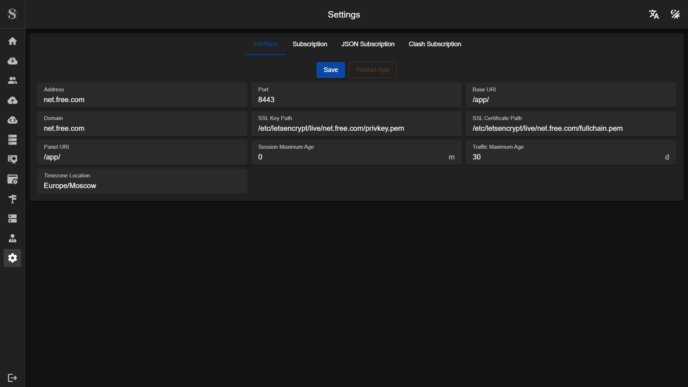
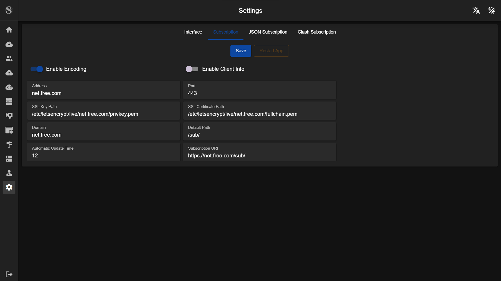
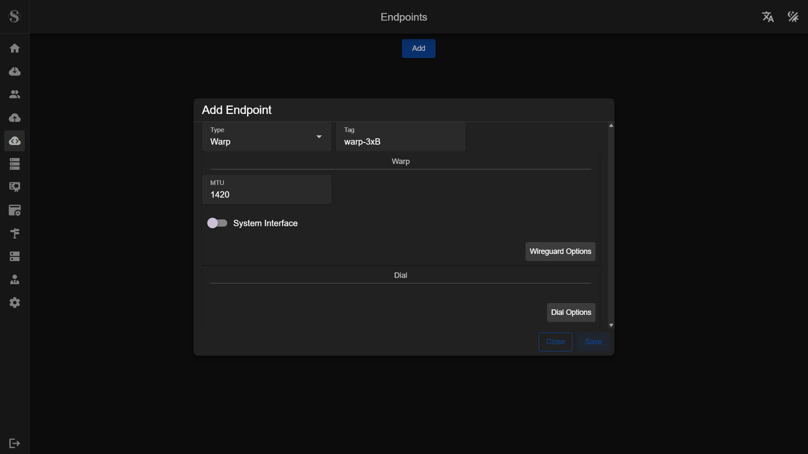
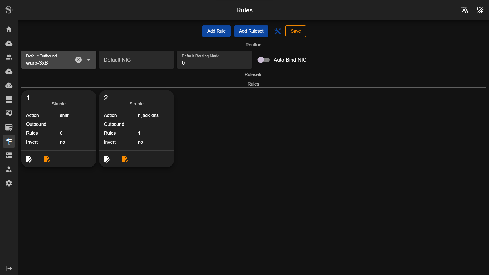
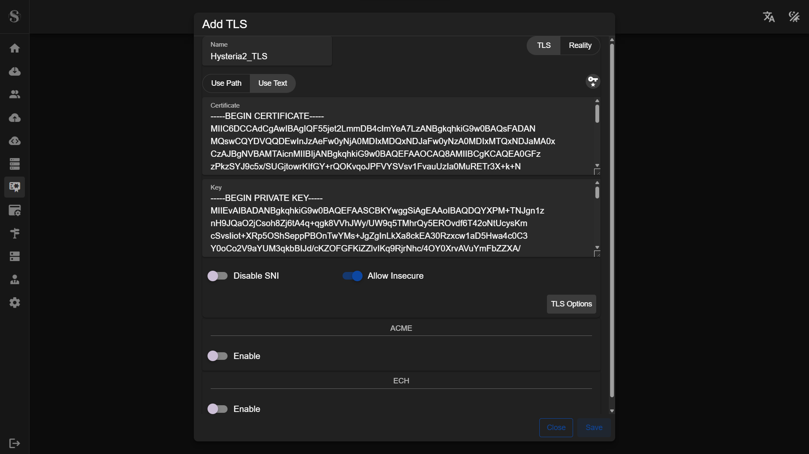
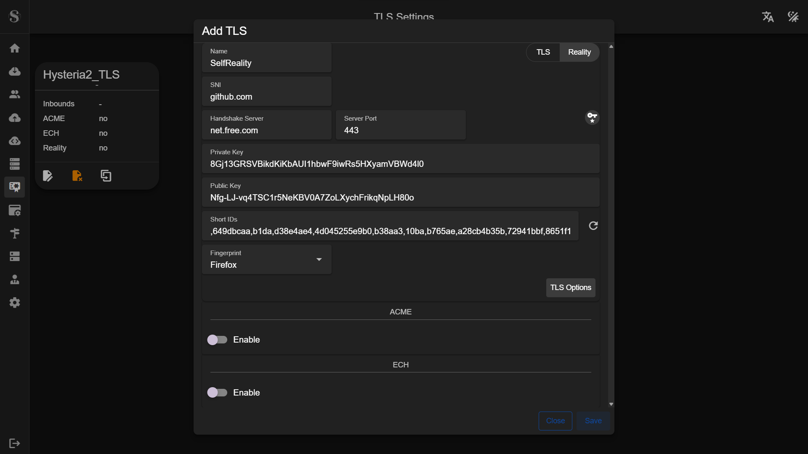
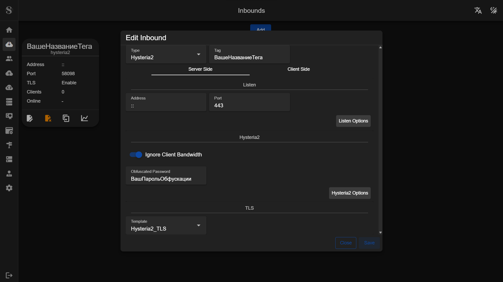
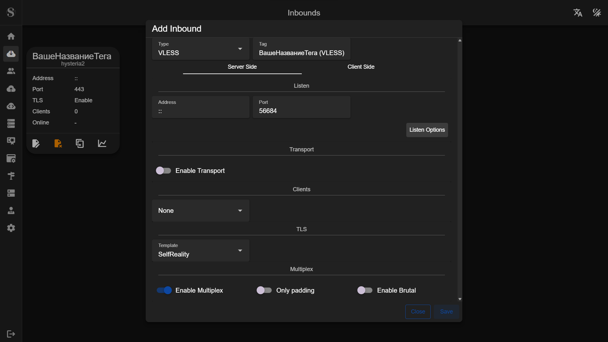
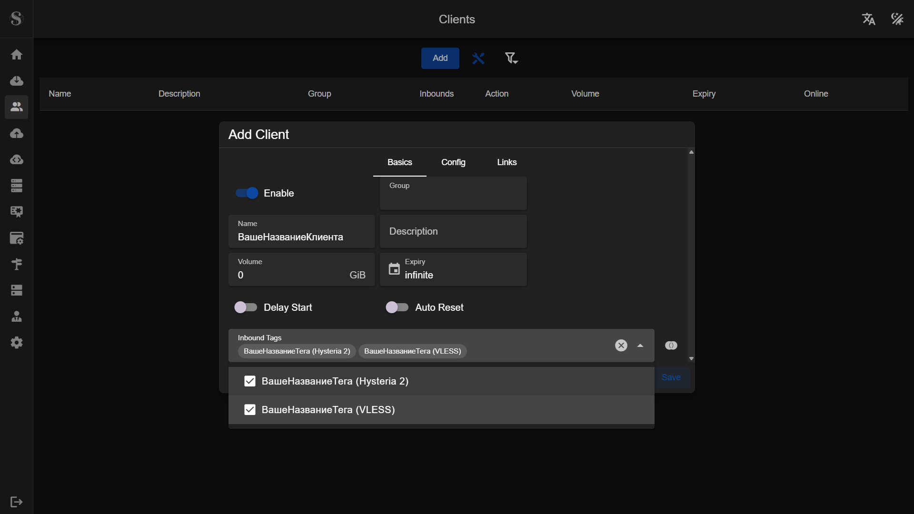

# Установка и настройка панели S-UI

В предыдущих статьях мы рассматривали панель 3x-ui на базе Xray-core. А теперь детально разберем панель **S-UI** (от разработчика alireza0). 

## Главные отличия S-UI от X-UI

Главное отличие кроется «под капотом»: S-UI работает на базе ядра **Sing-box**, а не Xray. Sing-box часто называют «универсальной платформой проксирования». Вот что это дает на практике:
1. **Поддержка Hysteria 2 и TUIC:** Это современные протоколы, работающие поверх UDP. Они показывают феноменальную скорость и стабильность даже на сетях с высокими потерями пакетов (например, при плохом мобильном интернете или сильном дросселировании трафика провайдером).
2. **Модульная маршрутизация:** В отличие от X-UI, где настройки смешаны, в S-UI интерфейс разделен на логические блоки: *TLS Settings* (сертификаты), *Endpoints* (куда идет трафик), *Inbounds* (входящие подключения) и *Rules* (правила маршрутизации). Это дает более тонкий контроль над сервером.
3. **Производительность:** Sing-box потребляет меньше оперативной памяти и зачастую лучше работает на бюджетных VPS.

Ее первоначальная настройка требует чуть больше действий, но именно для этого и создано данное руководство.

---

## Предварительная подготовка

Вам потребуется арендованный VPS и доменное имя. 

В отличие от 3x-ui, для S-UI **нам понадобится только один поддомен**. Возьмем для примера домен `free.com` и в панели управления DNS (у вашего регистратора или Cloudflare) создадим **A-запись**, например `net.free.com`, которая будет указывать на IP-адрес вашего сервера.

---

## Установка панели S-UI

Подключаемся к серверу по SSH. Для начала необходимо обновить все системные компоненты:

```bash
sudo apt update && sudo apt upgrade -y
````

После этого запускаем скрипт установки S-UI:

```bash
bash <(curl -Ls https://raw.githubusercontent.com/alireza0/s-ui/master/install.sh)
```

В процессе установки скрипт задаст несколько вопросов:

1.  На вопрос `Do you want to continue with the modification [y/n]?` нажимаем `y` и `Enter`.
2.  Далее нужно настроить порты и пути (URL) для доступа к панели и подпискам. Для порта панели укажем `8443`, порт подписки укажем `443`. Пути можно оставить по умолчанию, просто нажимая `Enter`.

Пример ввода:

```text
Enter the panel port (leave blank for existing/default value):
8443
Enter the panel path (leave blank for existing/default value):

Enter the subscription port (leave blank for existing/default value):
443
Enter the subscription path (leave blank for existing/default value):
```

3.  Далее вас спросят: *«Хотите ли вы поменять данные для входа в панель?»* (`Do you want to change admin credentials [y/n]?`).
    Можете нажать `y`, `Enter` и задать свои логин и пароль. Если отказаться (`n`), данные по умолчанию будут: логин — `admin`, пароль — `admin` (их можно будет изменить позже в веб-интерфейсе).

Дожидаемся окончания установки. В конце в терминале появится ссылка:

```text
You may access the Panel with following URL(s):
Local address:
http://<ip-вашего-сервера>:8443/<ваш-путь-панели>
```

:::danger Важно
Обязательно скопируйте и сохраните эту ссылку\!
:::

-----

## Получение SSL-сертификата (Certbot)

Чтобы панель и подписки работали по безопасному HTTPS протоколу, нужно выпустить бесплатный сертификат Let's Encrypt для нашего поддомена.

Устанавливаем пакетный менеджер `snapd`:

```bash
sudo apt update && sudo apt install snapd -y
```

Далее через `snap` устанавливаем утилиту Certbot:

```bash
snap install core; snap refresh core
snap install --classic certbot
ln -s /snap/bin/certbot /usr/bin/certbot
```

Теперь получаем сертификат для нашего домена. **Замените `net.free.com` на ваш реальный поддомен\!**
*(Убедитесь, что порт 80 на сервере свободен и не заблокирован файрволом).*

```bash
certbot certonly --standalone --register-unsafely-without-email --non-interactive --agree-tos -d net.free.com
```

В случае успеха вы увидите пути к сохраненным сертификатам:

```text
Successfully received certificate.
Certificate is saved at: /etc/letsencrypt/live/net.free.com/fullchain.pem
Key is saved at:         /etc/letsencrypt/live/net.free.com/privkey.pem
```

Скопируйте пути к `fullchain.pem` и `privkey.pem` — они нам скоро понадобятся.

-----

## Настройка веб-интерфейса S-UI

На этом работа в терминале закончена. Переходим в браузере по ссылке, которую мы сохранили после установки панели, и авторизуемся.

### Настройка доступа к панели

1.  Переходим в **Settings** -\> раздел **Panel**.
2.  Заполняем данные для того, чтобы панель открывалась по нашему красивому поддомену с HTTPS. Указываем порт `8443`, ваш поддомен, и прописываем пути к сертификатам, полученным от Certbot.



Сохраняем (Save) и перезапускаем панель (Restart). Теперь заходим в панель уже по новому адресу: `https://net.free.com:8443/...`

### Настройка ссылок на подписку

1.  Снова идем в **Settings** -\> раздел **Subscription**.
2.  Указываем порт `443`, ваш поддомен и те же пути к сертификатам. Это нужно, чтобы клиентские приложения могли безопасно скачивать ваши конфиги. 
3.  Сохраняем и перезапускаем панель.



-----

## Настройка маршрутизации (WARP)

Мы направим исходящий трафик сервера через Cloudflare WARP. Это поможет скрыть IP-адрес вашего VPS от целевых сайтов и избежать капчи (например, при использовании Google или ChatGPT).

1.  Переходим в раздел **Endpoints** и нажимаем **Add**.
2.  В поле **Type** выбираем **WARP**. Остальное оставляем по умолчанию. Сохраняем.



3.  Теперь нужно указать ядру использовать этот Endpoint. Переходим в **Rules**.
4.  В поле **Default Outbound** (Действие по умолчанию) выбираем созданный нами WARP. Сохраняем.



-----

## Настройка TLS и подключений (Inbounds)

В S-UI объекты TLS и сами входящие подключения настраиваются раздельно. Сначала создаем криптографические профили, а затем "навешиваем" их на нужные порты.

### Создание TLS-профилей

**Для Hysteria 2:**

1.  Переходим в **TLS Settings**, нажимаем **Add**.
2.  Называем профиль (например, `Hysteria2_TLS`).
3.  Генерируем ключи нажатием на иконку ключа.
4.  **Обязательно** включаем `Allow Insecure`. Сохраняем.



**Для VLESS-Reality:**

1.  Снова нажимаем **Add** в **TLS Settings**.
2.  Справа сверху переключаем тип с `TLS` на `Reality`.
3.  Задаем имя (например, `Reality-VLESS`).
4.  **SNI**: пишем любой доступный зарубежный сайт (для примера `github.com` или `yahoo.com`).
5.  **Handshake Server**: указываем наш поддомен (`net.free.com`).
6.  Генерируем ключи (иконка ключа).
7.  В поле **Fingerprint** выбираем `Firefox` или `Chrome`. Сохраняем.



### Создание точек входа (Inbounds)

Теперь "привязываем" созданные профили к протоколам. Переходим в раздел **Inbounds**.

**Создаем подключение Hysteria 2:**

1.  Нажимаем **Add**.
2.  **Type:** `Hysteria2`.
3.  **Tag:** придумываем понятное имя (например, `in-hysteria2`).
4.  **Port:** `443`.
5.  Включаем `Ignore Client Bandwidth`.
6.  В разделе *Hysteria2 Options* включаем `Obfuscated Password`. Появится поле — придумайте сложный пароль обфускации от 16 символов.
7.  В поле **TLS** выбираем созданный ранее `TLS-Hysteria`. Сохраняем.



**Создаем подключение VLESS:**

1.  Снова нажимаем **Add**.
2.  **Type:** `VLESS`.
3.  **Tag:** понятное имя (`in-vless`).
4.  Порт оставляем по умолчанию (сгенерированный системой).
5.  В поле **TLS** выбираем наш `Reality-VLESS`.
6.  Включаем `Enable Multiplex` для улучшения стабильности соединений. Сохраняем.



-----

## Создание клиента и получение подписки

Остался последний шаг — сгенерировать ссылку-подписку, которая объединит оба созданных подключения.

1.  Переходим в раздел **Clients**. Нажимаем **Add**.
2.  В поле **Name** вводите любое имя пользователя (например, `my-phone` или `first`).
3.  В поле **Inbound Tags** ставим галочки напротив обоих созданных подключений. Сохраняем.



### Как подключиться?

В строке созданного клиента нажмите на иконку **QR-кода**.
Вас интересует QR-код с подписью **Subscription**. Просто нажмите на сам QR-код, и ссылка на подписку автоматически скопируется в буфер обмена.

Теперь эту ссылку можно вставить в любой клиент (например, NekoBox, Hiddify или v2rayNG), и у вас появится доступ сразу к двум мощным протоколам: VLESS+Reality и Hysteria 2\!

---

:::gratitude
* Автор репозитория [S-UI](https://github.com/alireza0/s-ui) - [alireza0](https://github.com/alireza0)
:::